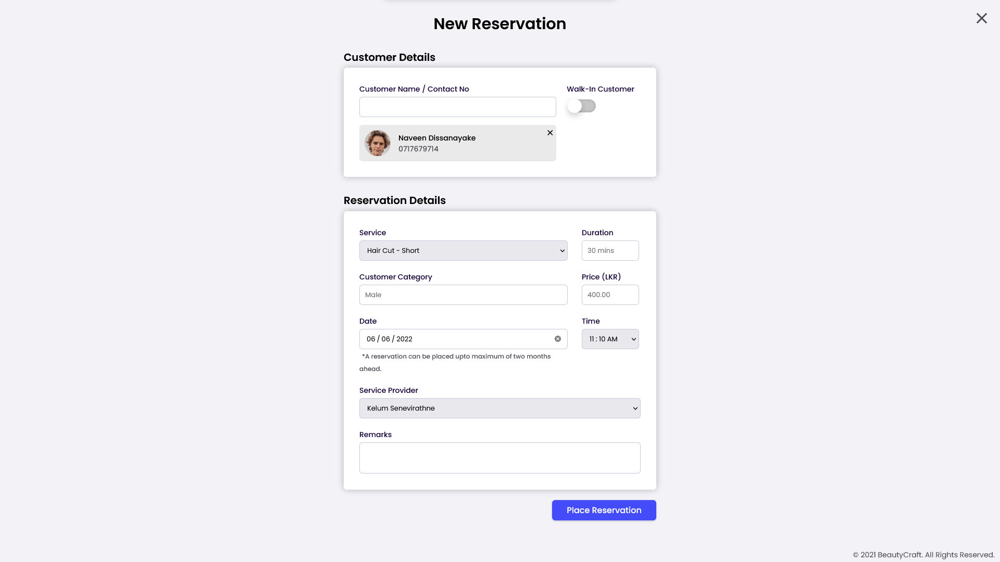
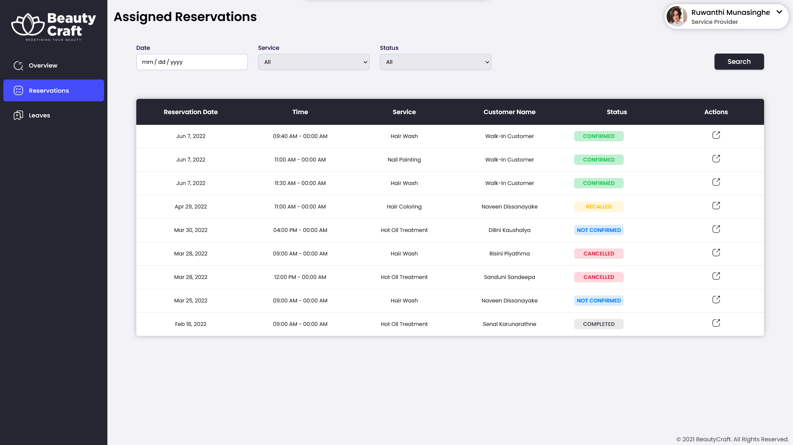
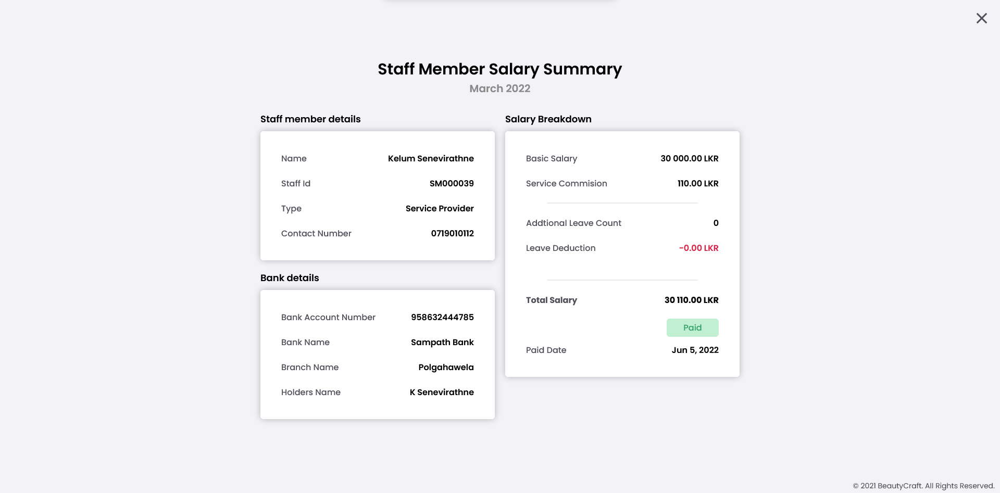

# "Beauty Craft" - An Integrated Management System for Salons

Beauty Craft mainly focuses on efficient and user-friendly reservation management as well as managing the organizational work of beauty salons requiring minimum user effort and time.

## Subsystems
- Reservation Management
- Services and Resources Handling
- Customer and Staff Handling
- Leaves and Salary Management
- Report Generation

## Users
- Customers
- Service Providers
- Receptionist
- Manager
- Owner

## Product Features
- Allow customers to place reservations based on their preference of date, time, and service provider.
- Manage reservations based on date, time, and selected service provider's availability and availability of resources.
- Provide a daily overview of upcoming reservations to service providers.
- Handle reservation reschedule/cancel requests by both customers and service providers.
- Handle payment/refund/void invoices of reservations.
- Allow senior staff to handle casual/medical leaves of staff members. 
- Calculate salaries based on the services provided and leaves taken.
- Generate reports for senior staff to support managerial decisions.
- Inform new/updates of reservations to customers and service providers via SMS.
- Log records of major operations of the system for security purposes.

## Screen Captures

